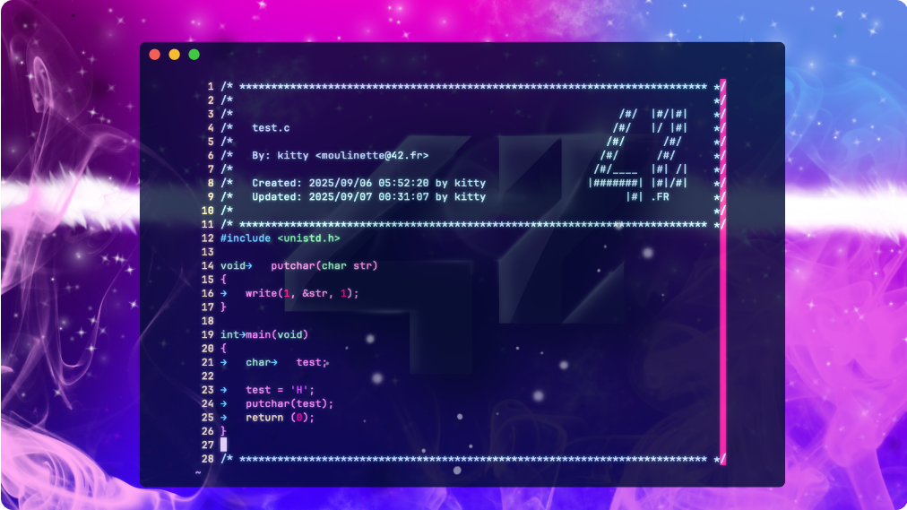

# **42 HEADER**

|NETWORK. |URL                                                                      |
|--------:|:------------------------------------------------------------------------|
|WWW      |[42 Paris](http://42.fr)                                                 |
|LINKEDIN |[42 Born 2 Code (Paris)]( https://www.linkedin.com/company/42-born2code/)|
|LINKEDIN |[42 The Network](https://www.linkedin.com/school/42network/)             |
|INSTAGRAM|[42 Born 2 Code (Paris)](https://www.instagram.com/42.born2code/)        |
|INSTAGRAM|[42 The Network](https://www.instagram.com/42_network/)                  |
|TIKTOK   |[42 Born 2 Code (Paris)](https://www.tiktok.com/@42.born2code)           |

`Stdheader` is the standard 42 header for the Vim editor and Vim projects (for pisciners and students).


<!-- You can change example with `img/stdheader_badass.png` if you prefer -->

## **UNIX SETUP (LINUX)**

Copy `stdheader.vim` into your `~/.vim/plugin`, or use your favorite plugin
manager. Then set the user and mail variables as explained below.

**Note for pisciners and beginners :**  
The tilde <kbd>~</kbd> represent your home folder. Find the key on your keyboard. Folders and files starting with a **dot** are hidden. To diplay them: 

```sh
cd ~
```
use **ls** and **-la** argument 

```sh
ls -la
```
so, now you can use the **mv** command or *GUI* paste with open

```sh
open .vim/plugin
``` 

### Option 1: export USER and MAIL in your shell configuration file

Add in `~/.zshrc` your:

+ `USER`
+ `MAIL`

### Option 2: set user and mail values directly in your vimrc

```vim
let g:user42 = 'yourLogin'
let g:mail42 = 'yourLogin@student.42.fr'
```

If you do not set your login & mail, the default `johndoe` value will be replaced by **moulinette**

## USAGE

In **NORMAL** mode  you can use `:Stdheader` or simply press the shortcut <kbd>F1</kbd>.  
**Note for pisciners and beginners :**  in Vim, you have three main modes (there are more in reality):

* 	`INSERT` key <kbd>i</kbd>
*  `VISUAL` key <kbd>v</kbd>
*  `NORMAL` key <kbd>esc</kbd>

On **Linux** you may need to disable your **terminal default help** shortcut:

For **Terminator:**  
Right click -> Preferences -> Shortcuts -> change help to something other than <kbd>F1</kbd>

### CLUSTER CONFIGURATION (SETUP)

Inside the **42 clusters** you can simply run:

```
$ ./set_header.sh
```

## CREDITS
|WHOIS                                          |CONTRIBUTION |
|-----------------------------------------------|-------------|
|[@zazard](https://github.com/zazard)           | creator     |
|[@alexandregv](https://github.com/alexandregv) | contributor |
|[@mjacq42](https://github.com/mjacq42)         | contributor | 
|[@sungmcho](https://github.com/lordtomi0325)   | contributor | 
|[@fclivaz42](https://github.com/fclivaz42)     | contributor | 
|[@nephcode](https://github.com/nephcode)       | contributor |

## BONUS
```asciiart
      /#/  |#/|#|
     /#/   |/ |#|
    /#/      /#/
   /#/      /#/
  /#/____  |#| /|
 |#######| |#|/#|
       |#| .FR    
       
Made with love <3 for 42 
Bonus wallpaper --> /img/badass42wallpaper.png
```


## **LICENSE**

This work is published under the terms of the **[42 Unlicense](https://github.com/gcamerli/42unlicense)**.

